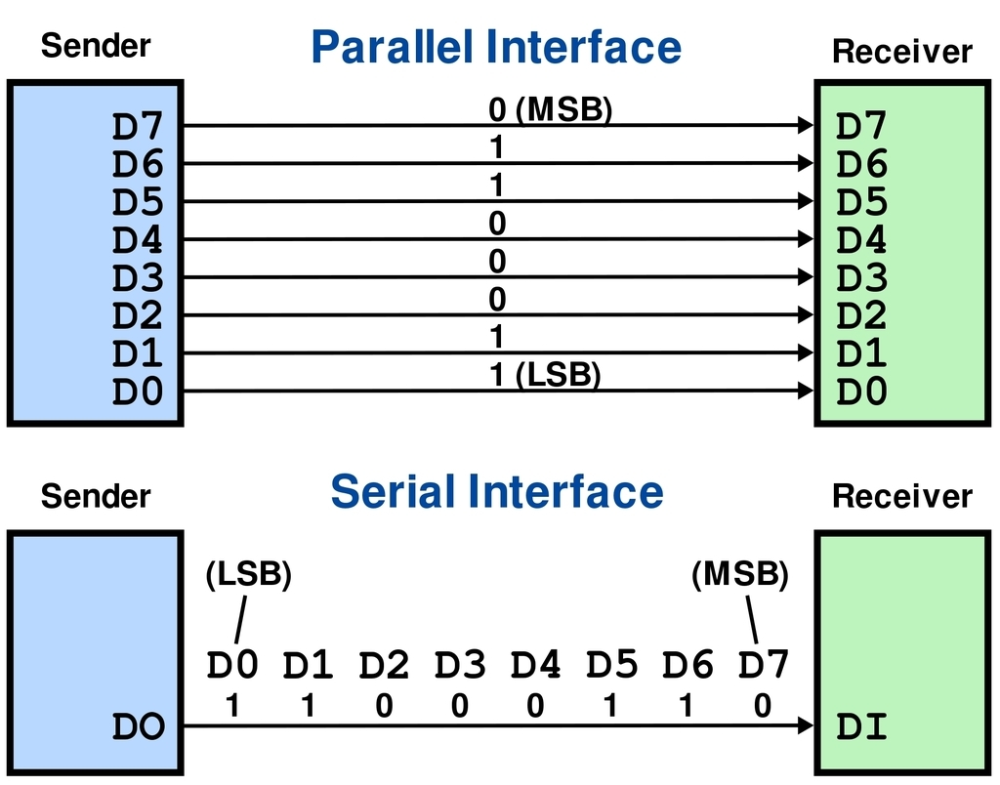
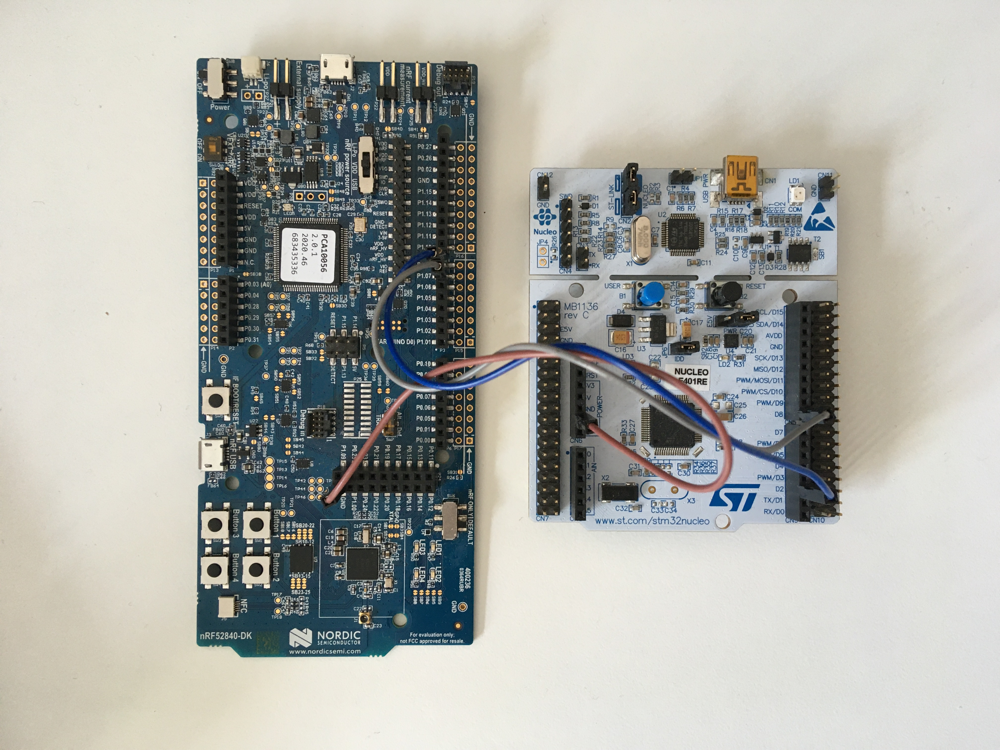
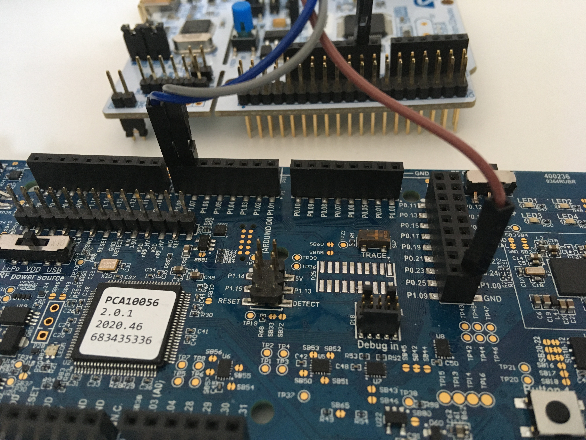
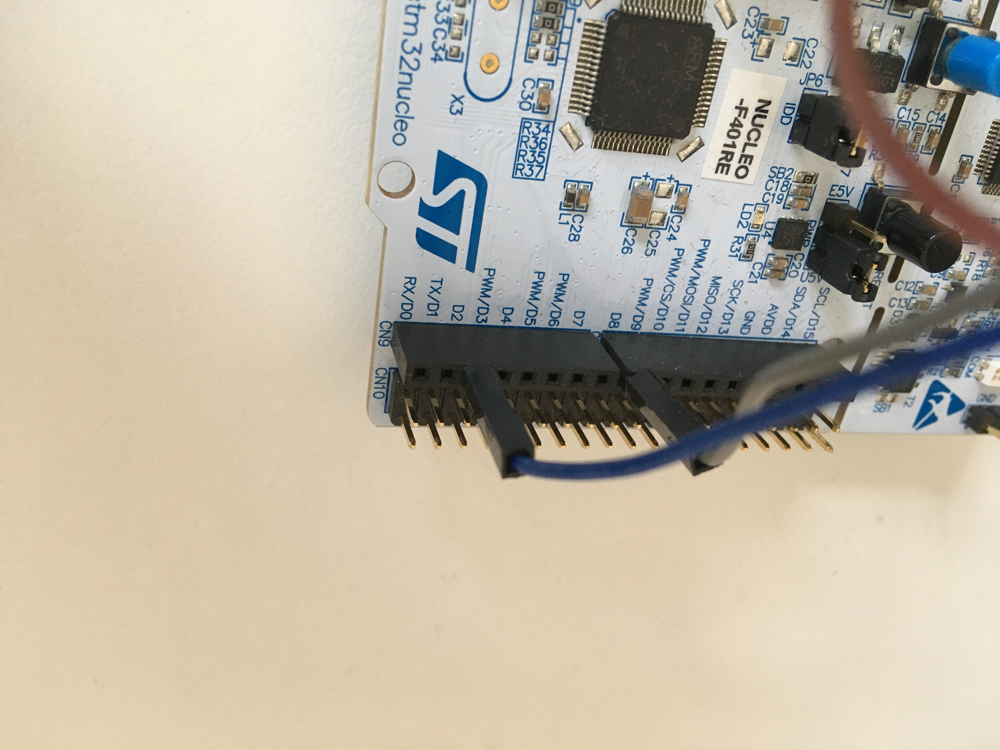

[](https://github.com/Dajamante/nucleo_playground/actions/workflows/build.yml)

# UART between nRF52/STM32F401

This repository is a collection of uart "pair" programs between nRF52 (the sender) and STM32F401-Nucleo (the receiver) with increasing level of difficulty. They are built with [RTIC](https://rtic.rs/1/book/en/), a concurrency framework for Cortex-M devices.

## UART
<p align="center">

</p>

Source:[AdaFruit](https://learn.adafruit.com/circuit-playground-express-serial-communications/what-is-serial-communications)

UART (universal asynchronous receiver-transmitter) is one of the important serial protocols to know in embedded. Others are for example SPI, I2C, USB. UART is asynchronous, i.e. it has no clock but the transmitter and receiver have agreed on a baud rate. Since they are not in sync it becomes difficult to do anything faster than 1M!

The advantage is that both sides can initiate a transfer. On the contrary, SPI and I2C initiate a master (controller) and one or more slaves (peripheral devices). Here, only the master can initiate a transfer. 

The disadvantage is that it is only point-to-point, i.e. you can not talk to several devices on a common bus as you can with SPI and I2C.

## RTIC

RTIC shines in simplifying concurrency - messages are passed between `#[task]`s with different levels of priority, guaranteeing deadlock-free and datarace free execution, and [many other garantees](https://github.com/rtic-rs/cortex-m-rtic).


## COBS and Postcard 💌

The first programs communicate with each other by sending `0`s and `1`s, for example to turn the light on and off. 
From program #6 I use `postcard.rs`, [COBS](https://en.wikipedia.org/wiki/Consistent_Overhead_Byte_Stuffing) is used to frame instructions in "efficient, reliable, unambiguous" packets, because you don't want to send instructions as a cave woman.
A great crate to do that is [postcard-rs](https://docs.rs/postcard/latest/postcard/#setup---cargotoml).
## Template

All programs in this project are done with [the Knurling App template](https://github.com/knurling-rs/app-template). If you want to do your own, follow the steps in the documentation!

# Wiring
* Nucleo D8/PA9 (tx) - nRF52 p1.07 (rx)
* Nucleo D2/PA10 (rx)- nRF52 p1.08 (tx)
* GND - GND

<p align="center">



</p>


# How to run code

Some programs are interracting, with the nRF52 as the sender and the Nucleo as the receiver. They are of increasing order of difficulty.

Open one terminal window *per* microcontroller and run:

```
cargo rb <project name>
```
For example, to try interracting program #3, you would:

```terminal
[terminal nrf]
cargo rb uarte
```
```terminal
[terminal nucleo]
cargo rb usart
```

To try interracting program #4, you would:

```terminal
[terminal nrf]
cargo rb lightning
```
```terminal
[terminal nucleo]
cargo rb lightning
```

Most programs have the same name but I kept "uarte" and "usart" as this is how the protocol is named in [`nrf52840-hal`](https://docs.rs/nrf52840-hal/latest/nrf52840_hal/) and [`stm32f4xx-hal`](https://docs.rs/stm32f4xx-hal/latest/stm32f4xx_hal/serial/index.html) respectively.


|     | Interracting? | nRF52/Nucleo code   | What does it do?                                                                                                                                                                                |
| --- | ---------- | ------------------- | ----------------------------------------------------------------------------------------------------------------------------------------------------------------------------------------------- |
| 1   | No         | `minimal.rs`        | It says hi👋                                                                                                                                                                                    |
| 2   | No         | `blinky.rs`         | .. blinks a led💡                                                                                                                                                                               |
| 3   | yes        | `uarte.rs/usart.rs` | Sending byte beer emoji back and forth: <br /> `nRF52 says: look at this 🍻 we got back!`                                                                                                       |
| 4   | yes        | `lightning.rs`      | nRF52 is blinking the led of the nucleo 💡                                                                                                                                                      |
| 5   | yes        | `button.rs`         | nRF52 is blinking the led of the nucleo 💡, but with a button                                                                                                                                   |
| 6   | yes        | `postcard.rs`       | nRF52 is blinking the led of the nucleo 💡, with a proper instruction using [cobs](https://en.wikipedia.org/wiki/Consistent_Overhead_Byte_Stuffing) command. |
| 7   | yes        | `pws.rs`            | nRF52 is dimming(*) the light of the nucleo 🔅💡🔅                                                                                                                                              |
| 8   | yes        | `interval.rs`       | nRF52 is blinking the light of the nucleo, with intervals. The light can be dimmed 🔅💡🔅.                                                                                                      |

*ATM the dimmer function is very bad, and need to be fixed (the incrementation must be based on a function, not magic numbers).

## License

Licensed under either of

- Apache License, Version 2.0 ([LICENSE-APACHE](LICENSE-APACHE) or
  http://www.apache.org/licenses/LICENSE-2.0)

- MIT license ([LICENSE-MIT](LICENSE-MIT) or http://opensource.org/licenses/MIT)

at your option.

### Contribution

Unless you explicitly state otherwise, any contribution intentionally submitted
for inclusion in the work by you, as defined in the Apache-2.0 license, shall be
licensed as above, without any additional terms or conditions.

[Knurling]: https://knurling.ferrous-systems.com
[Ferrous Systems]: https://ferrous-systems.com/
[GitHub Sponsors]: https://github.com/sponsors/knurling-rs
