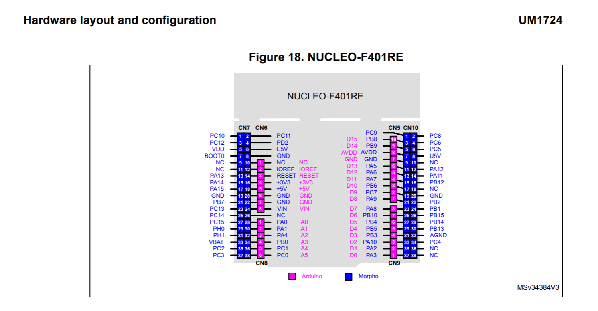
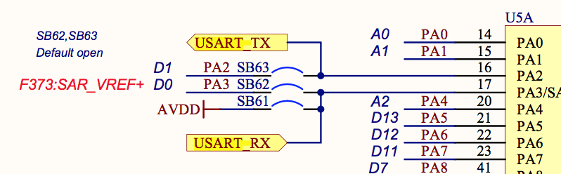
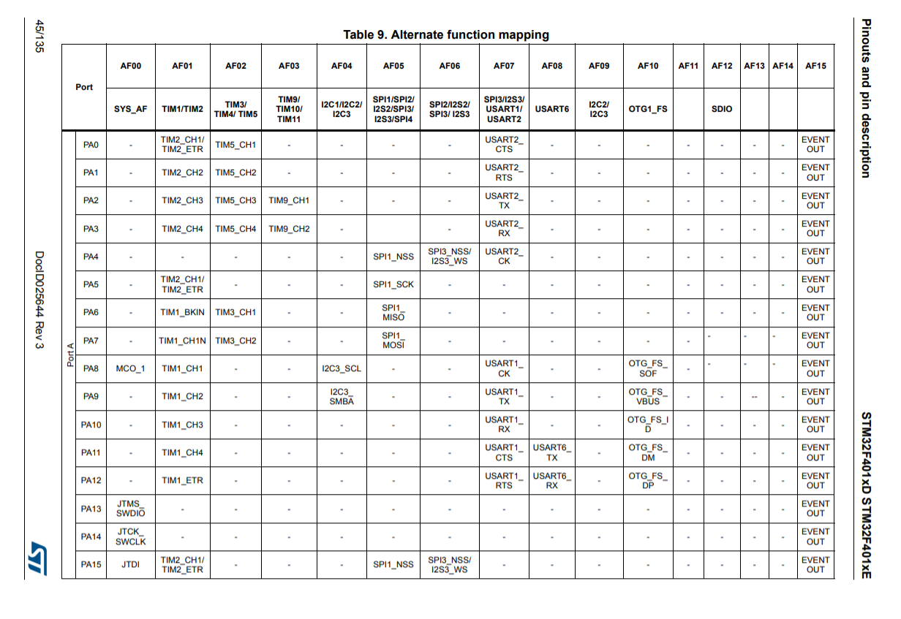

[](https://github.com/Dajamante/nucleo_playground/actions/workflows/build.yml)

# UART between nrf52 - stm32 

This repository is a collection of pairs of programs between nRF52840 DK and STM32F401-Nucleo, sending data with UART (universal asynchronous receiver-transmitter). The nRF52840 DK is the sender and the Nucleo the receiver (reversing messages is left as an exercise to the reader 😛). 

The goal of this repository is to provide simple examples, not teaching UART. The nRF52840 uses [UARTE](https://devzone.nordicsemi.com/f/nordic-q-a/62055/uart-and-uarte-difference), and the Nucleo uses USART, an UART that support synchronous operations as well.

Those boards were chosen because they are cheap and off the shelves (translate: I had them at home). I use STM32F401 Nucleo but any Nucleo for the stm32f4xx family of chips would work (with special caveat: look up pins, more on that in [the nucleo section](./README.md#nucleo-pins).

The code snipets are in increasing level of difficulty. 


# First things first: how to do the wiring?

* Nucleo D8/PA9 (tx) - nRF52 p1.07 (rx)
* Nucleo D2/PA10 (rx)- nRF52 p1.08 (tx)
* GND - GND

<p align="center">


</p>

# Second things ... second: how to run code?


Some programs are interracting, with the nRF52 as the sender and the Nucleo as the receiver. They are of increasing order of difficulty.

Open one terminal window *per* microcontroller and run:

```
cargo rb <project name>
```
For example, to try interracting program #3, you would:

```terminal
[terminal nrf]
cargo rb uarte
```
```terminal
[terminal nucleo]
cargo rb usart
```

To try interracting program #4, you would:

```terminal
[terminal nrf]
cargo rb lightning
```
```terminal
[terminal nucleo]
cargo rb lightning
```

Most programs have the same name but I kept "uarte" and "usart" as this is how the protocol is named in [`nrf52840-hal`](https://docs.rs/nrf52840-hal/latest/nrf52840_hal/) and [`stm32f4xx-hal`](https://docs.rs/stm32f4xx-hal/latest/stm32f4xx_hal/serial/index.html) respectively.


|     | Interracting? | nRF52/Nucleo code   | What does it do?                                                                                                                                                                                |
| --- | ---------- | ------------------- | ----------------------------------------------------------------------------------------------------------------------------------------------------------------------------------------------- |
| 1   | No         | `minimal.rs`        | It says hi👋                                                                                                                                                                                    |
| 2   | No         | `blinky.rs`         | .. blinks a led💡                                                                                                                                                                               |
| 3   | yes        | `uarte.rs/usart.rs` | Sending byte beer emoji back and forth: <br /> `nRF52 says: look at this 🍻 we got back!`                                                                                                       |
| 4   | yes        | `lightning.rs`      | nRF52 is blinking the led of the nucleo 💡                                                                                                                                                      |
| 5   | yes        | `button.rs`         | nRF52 is blinking the led of the nucleo 💡, but with a button                                                                                                                                   |
| 6   | yes        | `postcard.rs`       | nRF52 is blinking the led of the nucleo 💡, with a proper instruction using [cobs](https://en.wikipedia.org/wiki/Consistent_Overhead_Byte_Stuffing) command. |
| 7   | yes        | `pws.rs`            | nRF52 is dimming(*) the light of the nucleo 🔅💡🔅                                                                                                                                              |
| 8   | yes        | `interval.rs`       | nRF52 is blinking the light of the nucleo, with intervals. The light can be dimmed 🔅💡🔅.                                                                                                      |

*ATM the dimmer function is very bad, and need to be fixed (the incrementation must be based on a function, not magic numbers).

## RTIC

All projects are written with [RTIC](https://rtic.rs/1/book/en/), a concurrency framework for Cortex-M devices.

RTIC shines in simplifying concurrency - messages are passed between `#[task]`s with different levels of priority, guaranteeing deadlock and datarace free execution, and [many other guarantees](https://github.com/rtic-rs/cortex-m-rtic).
## UART
<p align="center">

</p>

Source:[AdaFruit](https://learn.adafruit.com/circuit-playground-express-serial-communications/what-is-serial-communications)

UART (universal asynchronous receiver-transmitter) is a serial protocol. Others are for example SPI, I2C, USB. UART is asynchronous, i.e. it has no clock but the transmitter and receiver have agreed on a baud rate. Since they are not in sync it becomes difficult to do anything faster than 1MHz!

The advantage is that both sides can initiate a transfer. On the contrary, SPI and I2C initiate a master (controller) and one or more slaves (peripheral devices). Here, only the master can initiate a transfer. 

The disadvantage is that it is only point-to-point, i.e. you can not talk to several devices on a common bus as you can with SPI and I2C.

## Differences between nRF52840 DK and STM32F401 Nucleo

There are some differences with the pin configuration that are noteworthy.

### <a id="nucleo-pins"></a> Nucleo pins



On the Nucleo, you must look up which functionality is available for each pin. According to the [Nucleo board manual](https://www.st.com/resource/en/user_manual/um1724-stm32-nucleo64-boards-mb1136-stmicroelectronics.pdf), you will need to use PA2 and PA3 if you want to use USART2. 
If the docs recommends to look up the solder bridges, it is a good idea to do so. If solder bridges are open, there is no communication and the project does not work.



In this mini projects, we are using USART1, so according to the [datasheet](https://www.st.com/resource/en/datasheet/stm32f401re.pdf) we use PA9 and PA10.

Are we done?

Not at all!

You need to configure alternate functions. On STM32, pins can have different functions so you need to specify which function you are going to use with the alternate functions table:



For USART1, we need alternate function 7 (AF07).

So the configuration will look like this:

```rust
#[local]
struct Local {
    // leds, etc
    usart: usart: Serial<USART1, (PA9<Alternate<PushPull, 7>>, PA10<Alternate<PushPull, 7>>), u8>,
}
```


### nRF52840

On the nRF52840 development board, you can use any pin. Or almost any pins! [According to the connector interface](https://infocenter.nordicsemi.com/index.jsp?topic=%2Fug_nrf52840_dk%2FUG%2Fdk%2Fconnector_if.html&cp=4_0_4_7_5), some pins have default settings. Connector P6 and P24 should be avoided, as per the figure.


## COBS and Postcard 💌

The first programs communicate with each other by sending `0`s and `1`s, for example to turn the light on and off. 
From program #6 I use `postcard.rs`, [COBS](https://en.wikipedia.org/wiki/Consistent_Overhead_Byte_Stuffing) is used to frame instructions in "efficient, reliable, unambiguous" packets, because you don't want to send instructions as a cave woman.
A great crate to do that is [postcard-rs](https://docs.rs/postcard/latest/postcard/#setup---cargotoml).
## Template

All programs in this project are done with [the Knurling App template](https://github.com/knurling-rs/app-template). If you want to do your own, follow the steps in the documentation!


## License

Licensed under either of

- Apache License, Version 2.0 ([LICENSE-APACHE](LICENSE-APACHE) or
  http://www.apache.org/licenses/LICENSE-2.0)

- MIT license ([LICENSE-MIT](LICENSE-MIT) or http://opensource.org/licenses/MIT)

at your option.

### Contribution

Unless you explicitly state otherwise, any contribution intentionally submitted
for inclusion in the work by you, as defined in the Apache-2.0 license, shall be
licensed as above, without any additional terms or conditions.

[Knurling]: https://knurling.ferrous-systems.com
[Ferrous Systems]: https://ferrous-systems.com/
[GitHub Sponsors]: https://github.com/sponsors/knurling-rs
